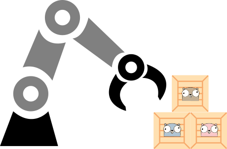

# Go kit

<p align="center">

</p>

<p align="right" style="color:silver">
Gophers by the great site gopherize.me
</p>

## Introduction

Welcome gophers !

This is a higher level, personal standard lib. A little space in the Git universe where its intended
the [unix philosophy](https://en.wikipedia.org/wiki/Unix_philosophy) to take place.

### Disclaimer 

The uses of this module are under discovery. There's no stability promise. This means that interfaces could change between commits. No other versioning is intended at this moment. 

## Motivation

Software developers often work with similar patterns over and over again. This isn't exclusive regarding production code, but also testing
patterns and tools. Go promotes the creation of small and cohesive tools. This repo is a space for that kind of small, reusable packages
across projects.

## How to use this library

In order to use any of the packages of this Go module, use the following import url:

```
go get go.eloylp.dev/kit
```

## Table of contents

1. [Archive tools](#archive-tools)
2. [Parallelization helpers](#parallelization-helpers)


### Archive tools

We can create `tar.gz` file given any number of paths, which can be files or directories:

```go
package main

import (
	"fmt"

	"go.eloylp.dev/kit/archive"
)

func main() {
	b, err := archive.TARGZ("/tmp/test.tar.gz", "/home/user/Pictures", "/home/user/notes.txt")
	if err != nil {
		panic(fmt.Errorf("error creating tar: %v", err))
	}
	fmt.Printf("tar created. %v bytes of content were written\n", b)
}
```

The above feels familiar to how we would use the original `tar` command.

In order to decompress the `tar.gz` file we can just use the extraction function:

```go
package main

import (
	"fmt"

	"go.eloylp.dev/kit/archive"
)

func main() {
	b, err := archive.ExtractTARGZ("/home/user/destination", "/tmp/test.tar.gz")
	if err != nil {
		panic(fmt.Errorf("error extracting tar: %v", err))
	}
	fmt.Printf("tar extracted. %v bytes of content were written\n", b)
}
```

Finally, if you need a **stream based** interface, take a look to the `Stream` functions in the same package.

### Parallelization helpers

Some times its needed to parallelize a task during a certain time and gracefully wait until all the tasks are done.

Imagine that we have a service called `MultiAPIService`, which has 2 APIs. An `HTTP` one and a `TCP` one. We want to do a stress test on this service with the [Go race detector](https://go.dev/blog/race-detector) enabled, in order to catch some nasty data races. Lets see a code example on how we can stress such APIs:

```go
package main_test

import (
	"context"
	"sync"
	"testing"
	"time"

	"go.eloylp.dev/kit/exec"
)

func TestMain(t *testing.T) {

	// Service initialization logic ...

	const MAX_CONCURRENT = 10 // Max concurrent jobs per API.

	ctx, cancel := context.WithTimeout(context.Background(), 5*time.Second) // Test time.
	defer cancel()

	wg := &sync.WaitGroup{}

	// Launch all the parallelization for both APIs with exec.Parallelize
	go exec.Parallelize(ctx, wg, MAX_CONCURRENT, doHTTPRequest)
	exec.Parallelize(ctx, wg, MAX_CONCURRENT, doTCPRequest)

	wg.Wait() // Waiting for all tasks to end.

	// Service shutdown logic ...
}

func doHTTPRequest() {
	time.Sleep(100 * time.Millisecond)
}

func doTCPRequest() {
	time.Sleep(50 * time.Millisecond)
}
```

### Contributing

Before a piece of code reaches this repository, this can be a summary of the previous steps:

1. Code is created and tested in applications.

2. A pattern is detected in other project with similar needs.

3. Acceptable maturity of public interfaces is reached.

4. The piece of software and the tests, are promoted to this repo.

** idea : ite preferable to cover many use cases with an abstraction than making it too obtuse. In that case, a low level abstraction and a high level one should be provided.